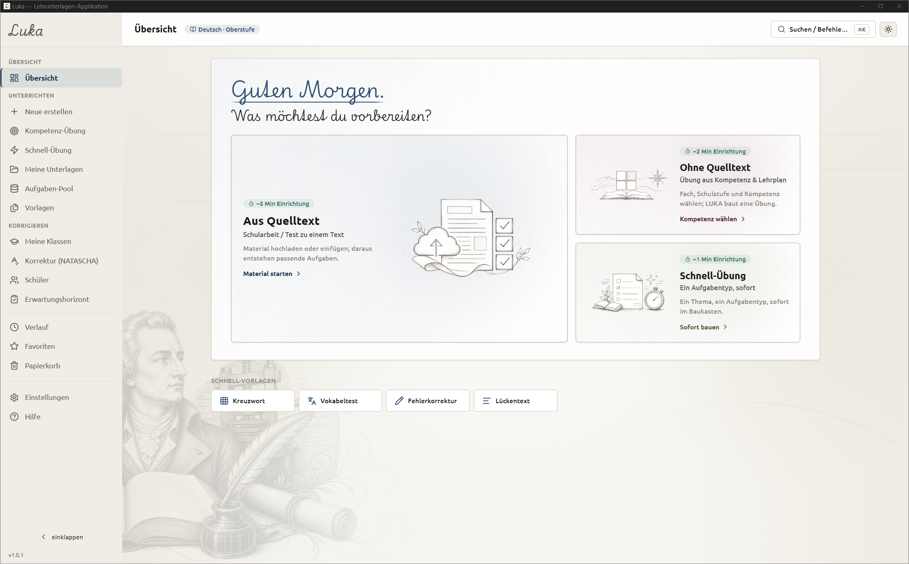
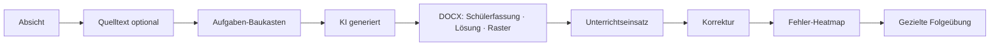
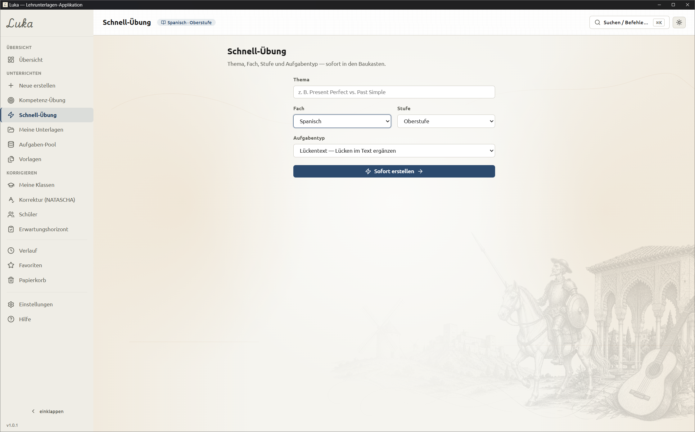
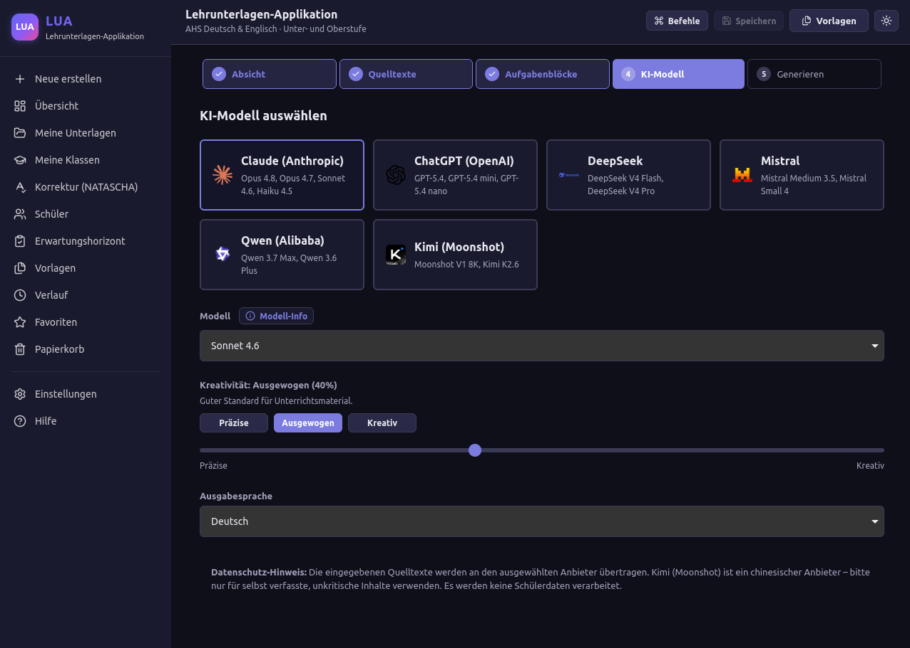
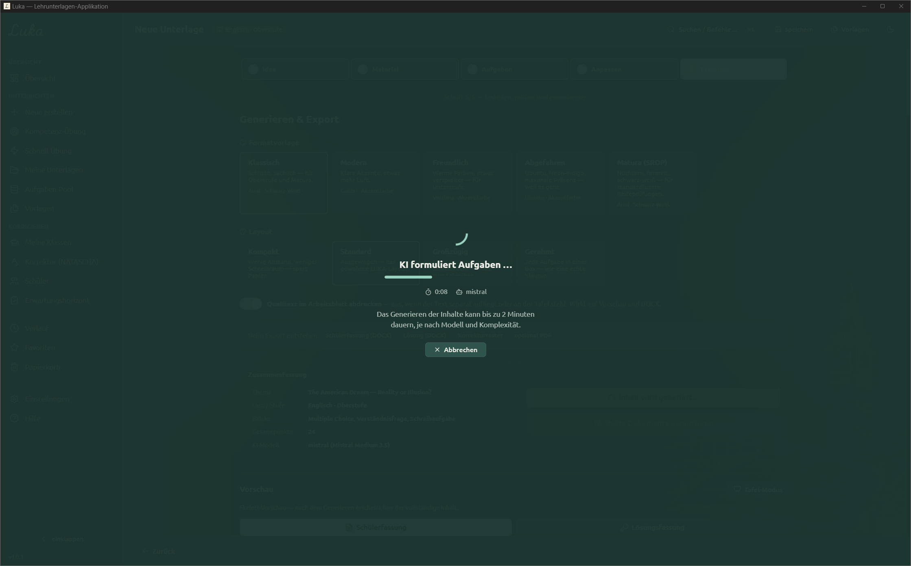
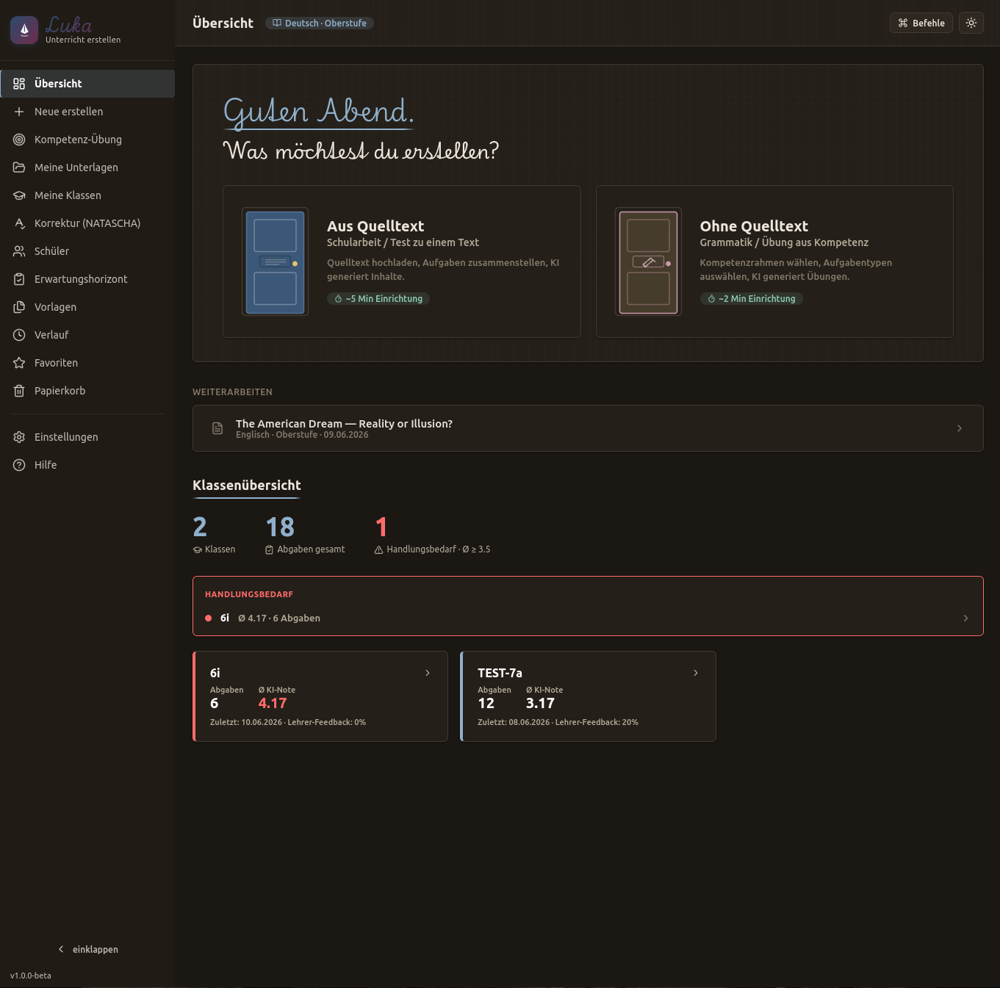
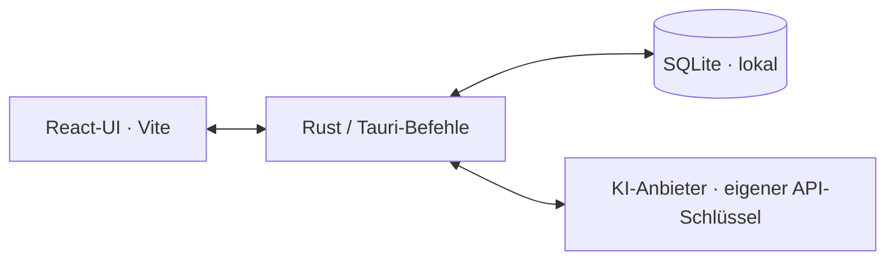

<div align="center">

# LUKA

**Lehrunterlagen und gezielte Korrektur mit KI — in Minuten statt Abenden.**

*Eine Desktop-App für Lehrkräfte: Arbeitsblätter, Übungen und Schularbeiten
erstellen, Schülerabgaben korrigieren und daraus gezielte Folgeübungen ableiten
— alles lokal, mit dem eigenen KI-Schlüssel.*




</div>

---

## Was ist LUKA?

LUKA ist ein lokales **Unterlagen- und Korrektur-Tool** für den textbasierten
Unterricht: Von der Absicht („Schularbeit Englisch, Oberstufe, zu diesem
Zeitungsartikel") bis zum fertigen DOCX-Paket — **Schülerfassung, Lösung und
Korrekturraster** — führt ein Assistent in fünf Schritten. Danach lassen sich
Abgaben mit Rubrik analysieren, Fehler in der Klasse auswerten und passende
Folgeübungen erzeugen. Drei Wege zur ersten Unterlage stehen offen:

- **Aus Quelltext** — Material hochladen oder einfügen (TXT/DOCX/PDF/HTML/URL);
  daraus entstehen passende Aufgaben.
- **Ohne Quelltext** — Übung aus Lehrplan-Kompetenz oder freiem Thema.
- **Schnell-Übung** — ein Thema, ein Aufgabentyp, sofort im Baukasten.

Alles läuft **lokal**: keine Accounts, kein Server, keine Cloud-Datenbank. Die KI
sprichst du mit deinem **eigenen API-Schlüssel** an (Mistral, Anthropic, OpenAI,
DeepSeek u. a.) — beim ersten Start führt dich die App durch Einrichtung und
Verbindungstest.



> **Closed Loop:** Die Korrektur ist in der Desktop-App integriert. Das
> gebündelte Modul prüft sich beim Öffnen selbst; wenn es nicht verfügbar ist,
> erklärt die App den Grund und bietet den technischen TUI-Fallback in den
> erweiterten Einstellungen an.

---

## Highlights

| Bereich | Was es kann |
|---|---|
| **Fächer** | Deutsch, Englisch, Französisch, Spanisch, Italienisch, Latein sowie Geschichte, Geographie, Religion, Ethik, Psychologie, Philosophie — und die neuen Fächer **Medien & Demokratie** und **Informatik & KI** |
| **Aufgabentypen** | Multiple Choice, Matching, Lückentext, Kategorisierung, Kreuzworträtsel, Wortgitter, Vokabelübung, Verständnisfrage, Schreibaufgabe, Fehlerkorrektur, Rollenspiel mit Rollenkarten u. v. m. |
| **Differenzierung** | Leichtere/schwerere Varianten auf Knopfdruck; Schwierigkeit nach Bloom, bei Fremdsprachen CEFR A2–B2 |
| **Aufgaben-Pool & Fachpakete** | Bewährte Aufgaben speichern, filtern, wiederverwenden — und als **Fachpaket (JSON) exportieren/importieren**, mit Vorschau und Duplikat-Kontrolle. Kuratiertes Startpaket liegt bei (`samples/fachpakete/`) |
| **Korrektur & Folgeübung** | Schülerabgaben mit Rubrik analysieren, Fehlerlisten und Feedback-DOCX erzeugen, Klassen-/Schülerauswertungen ansehen und aus Fehlerschwerpunkten eine Folgeübung starten |
| **Export** | DOCX (Schülerfassung, Lösung, Korrekturraster, Kompetenznachweis, Selbsteinschätzungsbogen), PDF (via LibreOffice), **Moodle/GIFT** |
| **Qualität** | Quality-Gate vor dem Export (Lernziel-Abdeckung, Wortzahl); einzelne Blöcke gezielt neu generieren |
| **Komfort** | Befehlspalette (`Ctrl+K`), Vorlagen, Verlauf, Favoriten, Dark-Mode, automatische Updates |

### Einblicke

| | |
|:--:|:--:|
|  |  |
| *„Aus Quelltext": Absicht erfassen — Unterlagentyp, Fach/Stufe, Thema* | *Schnell-Übung: ein Thema, ein Aufgabentyp, sofort im Baukasten* |
|  |  |
| *KI-Anbieter, Modell und Kreativitätsgrad wählen — BYOK, Schlüssel bleibt im OS-Schlüsselspeicher* | *Die KI formuliert — mit Fortschritt, Zeitangabe und Abbrechen* |
|  |  |
| *Fertige Aufgaben in der A4-Vorschau — pro Block „Neu generieren" oder „In Pool"* | *Dieselbe App im warmen Dark-Mode (Papier bei Nacht)* |

> Design „Tinte & Papier": warmer Papiergrund, Tinten-Akzent, handschriftliche
> Wortmarke, fachbezogene Randillustrationen; Light **und** Dark gleichwertig.
> Bildliste: [`screenshots/README.md`](screenshots/README.md).

---

## Installation

### Windows

1. Neueste `LUKA.-.Lehrunterlagen-Tool_*_x64-setup.exe` von den
   [**Releases**](https://github.com/milanradisavljevic/LUKA/releases/latest) laden
   und ausführen.
2. **SmartScreen-Hinweis:** Windows warnt bei neuen, (noch) nicht
   zertifikats-signierten Programmen. Über **„Weitere Informationen" →
   „Trotzdem ausführen"** geht es weiter — die App ist quelloffen, dieser Code
   hier ist genau das, was installiert wird.
3. Beim ersten Start: KI-Anbieter wählen, API-Schlüssel eintragen, Verbindung
   testen — fertig.

### macOS

1. Neueste `LUKA.-.Lehrunterlagen-Tool_*_universal.dmg` von den
   [**Releases**](https://github.com/milanradisavljevic/LUKA/releases/latest) laden,
   öffnen und die App in **Programme** ziehen.
2. **Gatekeeper-Hinweis:** Die App ist (noch) nicht mit einem Apple-Entwickler-
   zertifikat signiert. Beim ersten Öffnen meldet macOS „App ist beschädigt"
   oder „kann nicht überprüft werden" — das ist normal bei quelloffener
   Software ohne kostenpflichtiges Apple-Zertifikat, kein Hinweis auf Malware.
   Seit macOS 15 gibt es den früheren Rechtsklick-„Öffnen"-Trick nicht mehr.
   So geht's stattdessen:
   1. App einmal normal per Doppelklick öffnen — die Warnung wegklicken.
   2. **Systemeinstellungen → Datenschutz & Sicherheit** öffnen, ganz nach
      unten scrollen und **„Dennoch öffnen"** klicken.
   3. Nochmal öffnen und bestätigen — ab jetzt startet LUKA normal.
3. Beim ersten Start: KI-Anbieter wählen, API-Schlüssel eintragen, Verbindung
   testen — fertig.

Updates holt sich die App danach **automatisch** (signierte Update-Artefakte,
Nachfrage vor der Installation).

> Schritt-für-Schritt-Handbuch: **In-App-Hilfe** (Sidebar → *Hilfe*) oder
> [`docs/ANLEITUNG.md`](docs/ANLEITUNG.md).

---

## Aus dem Quellcode starten (Entwicklung)

**Voraussetzungen:** Node ≥ 20, [pnpm](https://pnpm.io), Rust-Toolchain (stable).
Unter Windows zusätzlich die
[Tauri-Voraussetzungen](https://tauri.app/start/prerequisites/) (WebView2, MSVC Build Tools).

```bash
cd apps/lua
pnpm install
pnpm tauri:dev        # startet die Desktop-App
```

---

## Architektur

```
LUKA/  (Repo: LUKA)
  apps/
    lua/        Desktop-App: TypeScript · React · Vite · Tauri (pnpm-Monorepo)
                packages/ schema · llm · input · renderer · qa · export
    natascha/   Korrektur-Kern (Python) — als headless Sidecar in LUA eingebaut
  docs/         Anleitung, Datenschutz, Invarianten, Szenarien
  samples/      synthetische Beispieldaten + kuratierte Fachpakete
```



Die React-UI ruft Rust/Tauri-Befehle auf; Rust verwaltet Datenbank,
Schlüsselspeicher und die KI-Anfragen. Alles liegt in **einer** lokalen
SQLite-Datei.

---

## Datenschutz

Beim Generieren und Korrigieren werden die jeweils nötigen Texte an den
gewählten KI-Anbieter übertragen. Bei Textabgaben kann LUKA erkannte Namen aus
der Klassenliste vor dem Versand durch stabile Aliasse ersetzen; PDF- und
Bildinhalte werden nicht automatisch redigiert. Datenbank und Exporte bleiben
**lokal** auf dem Rechner; echte Schülerdaten sind per `.gitignore` vom Repo
ausgeschlossen. Details: [`docs/DATENSCHUTZ.md`](docs/DATENSCHUTZ.md).

## Lizenz

Veröffentlicht unter der **MIT-Lizenz** — siehe [`LICENSE`](LICENSE).
© 2026 Milan Radisavljević.

## Roadmap

Pilotbetrieb des geschlossenen Unterrichtskreislaufs · freiwilliges lokales
Lehrerprofil und Community-Feedback · kuratierte Fachpakete und weitere
Lehrpläne nach belastbarer Abnahme des aktuellen Windows-/macOS-Releases.
