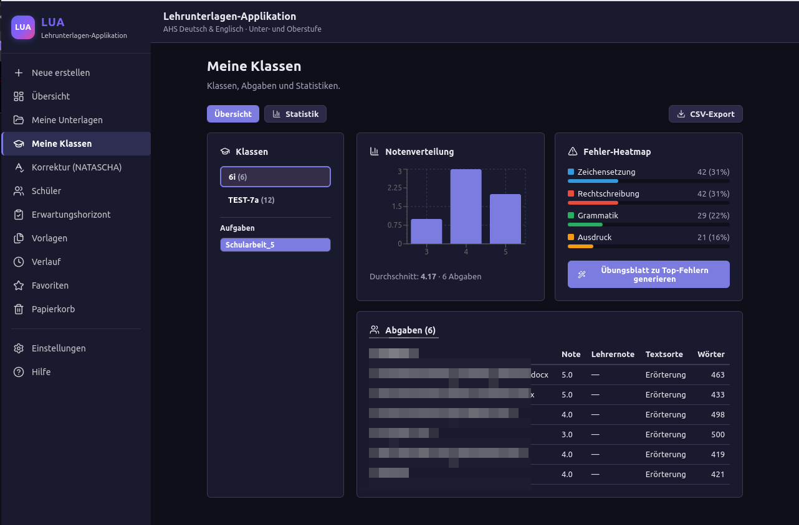
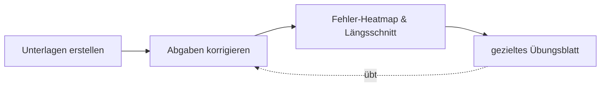
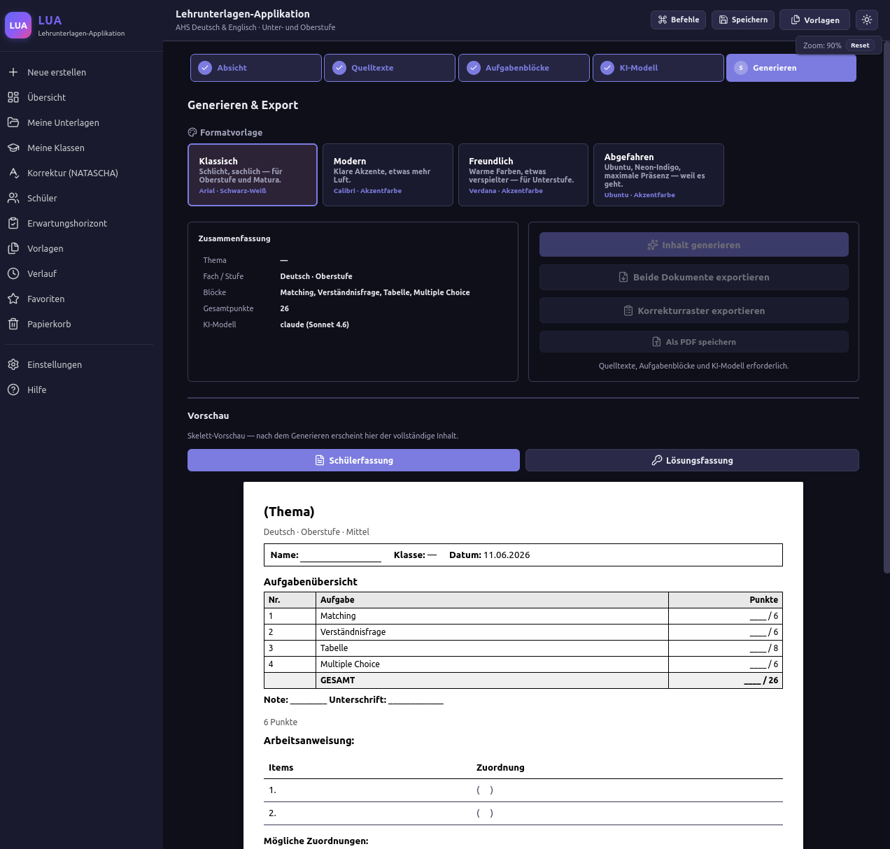
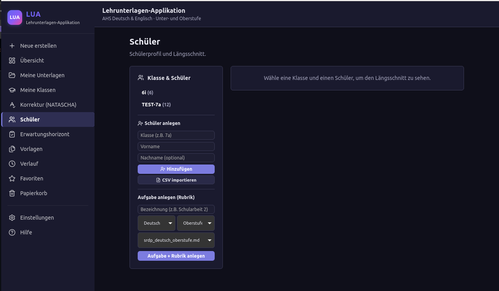
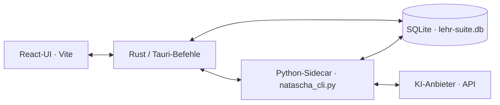

<div align="center">

# LUKA

**L**ehr**U**nterlagen &amp; **K**orrektur-**A**ssistent

*Eine Desktop-App, die den ganzen Kreislauf des Unterrichtens schließt:*
**Unterlagen erstellen → Abgaben korrigieren → gezielt üben lassen.**




</div>

---

## Was ist LUKA?

LUKA vereint zwei Lehrer-Werkzeuge in **einer** App mit **gemeinsamer Datenbank**:

- **Unterlagen-Generator** (vormals *Lehrunterlagen-Tool*) — erzeugt Arbeitsblätter,
  Übungen und Schularbeiten mit KI, exportiert sauber formatierte DOCX (Schülerfassung,
  Lösung, Korrekturraster).
- **Korrektur-Assistent** (vormals *NATASCHA*) — analysiert Schülerabgaben anhand von
  Rubriken, erzeugt Noten­empfehlung, Fehler-Heatmaps und Lern-Längsschnitte.

Der eigentliche Mehrwert ist die **Verbindung** beider Seiten: Aus den Korrekturen weiß
die App, **woran** eine Klasse oder einzelne Schüler:innen scheitern — und erstellt mit
einem Klick **passgenaue Übungsblätter** dazu.



---

## Highlights

| Bereich | Was es kann |
|---|---|
| **Generator** | Wizard von der Absicht zum DOCX; Baukasten aus Aufgabentypen; Quelltexte per Datei/URL/Direkteingabe |
| **Korrektur** | KI-Analyse einzelner Abgaben **und Batch** (ganze Klasse); Fehler nach **R/G/Z/A**; markierter Schülertext als A4-Vorschau; Lehrernote + Feedback-DOCX |
| **Klassen** | Fehler-Heatmap, Notenverteilung, Trend, Kalibrierung (KI vs. Lehrer), KI-Klassen-Briefing, Noten-CSV-Export |
| **Schüler** | Längsschnitt über mehrere Aufgaben, KI-Schüler-Profil, CSV-Import |
| **Erwartungshorizont &amp; Rubrik-Editor** | Musterlösungen generieren/speichern, Bewertungsraster in-app bearbeiten |
| **Übersicht** | Dashboard mit Kennzahlen und Klassen mit Handlungsbedarf |
| **Closed Loop** | Aus Heatmap **oder** Schüler-Schwächen → Übungsblatt im Generator (Fokus vorbefüllt) |

### Einblicke

| | |
|:--:|:--:|
|  |  |
| *Generator: Absicht festlegen (Stufe, Fach, Aufgabentypen)* | *KI-Modell &amp; Kreativität wählen — inkl. Datenschutz-Hinweis* |
|  |  |
| *DIN-A4-Vorschau &amp; DOCX-Export (Schüler-/Lösungsfassung)* | *Schüler &amp; Aufgaben anlegen, CSV-Import* |

> Weitere Aufnahmen (Korrektur-Zwei-Spalten, Dashboard, Rubrik-Editor) sind in
> [`screenshots/README.md`](screenshots/README.md) als To-do vermerkt.

---

## Architektur

```
LUKA/  (Repo: LUKA)
  apps/
    lua/        Generator + native Korrektur-/Klassen-/Schüler-Oberfläche
                TypeScript · React · Vite · Tauri (pnpm-Monorepo)
    natascha/   Korrektur-Kern als headless Python-Sidecar (natascha_cli.py)
                + eigenständige Textual-TUI (optional)
  bridge/       (intern) Datei-Brücke-Vertrag aus der Frühphase
  docs/         Testplan, Datenschutz, Screenshot-Liste
  samples/      synthetische Beispiel-Abgaben zum Testen
```



Die React-UI ruft Rust/Tauri-Befehle auf; Rust ist die **alleinige Quelle** für den
DB-Pfad und reicht ihn an den Python-Sidecar weiter. Beide Seiten teilen **eine**
SQLite-Datei (`~/lehr-suite-bridge/lehr-suite.db`).

---

## Aus dem Quellcode starten

> Die Test-Version läuft aus dem Quellcode (kein Installer). Für den späteren
> Windows-Build / Installer siehe Roadmap unten.

**Voraussetzungen:** Node ≥ 20, [pnpm](https://pnpm.io), Rust-Toolchain (stable),
Python ≥ 3.11. Unter Windows zusätzlich die
[Tauri-Voraussetzungen](https://tauri.app/start/prerequisites/) (WebView2, MSVC Build Tools).

**1 · App (LUA):**
```bash
cd apps/lua
pnpm install
pnpm tauri:dev        # startet die Desktop-App
```

**2 · Korrektur-Sidecar (Python):**
```bash
cd apps/natascha
python -m venv .venv && source .venv/bin/activate   # Windows: .venv\Scripts\activate
pip install -r requirements_cli.txt
python seed_testdaten.py          # optionale Test-DB (Klasse TEST-7a)
```

**3 · In der App einrichten** (*Einstellungen*):
- **API-Schlüssel** des KI-Anbieters hinterlegen (sicher im OS-Schlüsselspeicher).
- **Python-Befehl** und **NATASCHA-Ordner** setzen, damit die App den Sidecar findet.

**4 · Loslegen:** In *Korrektur* eine Datei aus `samples/` hochladen → analysieren →
in *Klassen* die Heatmap ansehen → „Übungsblatt zu Top-Fehlern". Fertig ist der Closed Loop.

> Komplette Schritt-für-Schritt-Anleitung: **In-App-Hilfe** (Sidebar → *Hilfe*) sowie
> [`docs/TESTPLAN.md`](docs/TESTPLAN.md).

---

## Datenschutz

Bei Korrektur, Erwartungshorizont und Schüler-Profil wird der jeweilige **Text an den
gewählten KI-Anbieter übertragen**. Daher: möglichst **pseudonymisierte** Abgaben
verwenden (keine Klarnamen). Alles andere bleibt **lokal** — Datenbank und Exporte
liegen auf dem Rechner, echte Schülerdaten sind per `.gitignore` ausgeschlossen.
Details: [`docs/DATENSCHUTZ.md`](docs/DATENSCHUTZ.md).

## Lizenz

Veröffentlicht unter der **MIT-Lizenz** — siehe [`LICENSE`](LICENSE).
© 2026 Milan Radisavljević.

## Roadmap (nach der Testphase)

Windows-Build/Installer · Python-Bündelung (PyInstaller-Sidecar, ohne Python-Installation
nutzbar) · automatisches Öffnen erzeugter DOCX · robustere Anbieter-Auswahl/Fallback.
